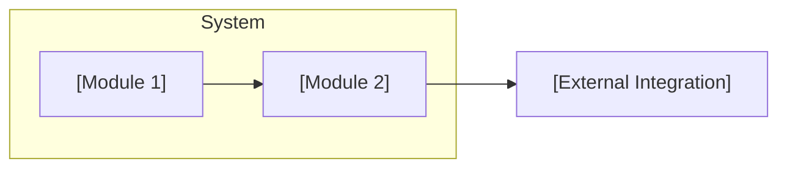

# Business Requirements Document: [SYSTEM NAME]

**Scope**: [Whole system | specific module/area named in $ARGUMENTS]
**Source**: Reverse-engineered from existing codebase by `/pandawa.brd`
**Created**: [DATE]
**Last Updated**: [DATE]
**Status**: Draft

## Executive Summary & Business Context

<!--
  ACTION REQUIRED: 2-4 sentences on what this system is, who it serves, and the
  business problem it solves. Derive from README/docs first; only fall back to
  inferring from code structure when no such docs exist.
-->

[What the system does and for whom, in business language.]

## Business Objectives

<!--
  ACTION REQUIRED: What business outcomes does this system exist to drive?
  Code rarely states "why" directly - infer from capabilities, but mark
  genuinely unknown intent rather than guessing confidently.
-->

- **[Objective 1]**: [Business goal the system appears to serve]

*Example of marking unclear intent:*

- **[Objective X]**: [NEEDS CLARIFICATION: original business driver for this capability not evident from code or docs]

## Stakeholders & Business Actors

<!--
  ACTION REQUIRED: Roles found in auth/permissions code, API consumers, or
  referenced in docs. System-wide actors only - an actor whose interaction is
  confined to a single module can instead be documented in that module's
  map file (modules/<slug>.md) if it doesn't belong here.
-->

| Actor | Role | Key Interactions |
| ----- | ---- | ---------------- |
| [Actor 1] | [Role description] | [What they do with the system] |
| [System/External Service] | [System role] | [Automated interactions] |

## Module Index

<!--
  ACTION REQUIRED: One row per module discovered during the survey. "Module"
  means a top-level business/domain folder in the source code (e.g. auth/,
  billing/, order/) - not a single entry point, not a freeform grouping.
  Folder is the module-slug used for docs/brd/modules/<slug>.md.
-->

| Module | Slug | Description | Map |
| ------ | ---- | ------------ | --- |
| [Module 1] | `[module-slug]` | [1-line description] | [modules/[module-slug].md](modules/[module-slug].md) |

## System Architecture

<!--
  ACTION REQUIRED: High-level only - overall tech stack, deployment topology,
  and how modules relate to each other and to external systems. Include one
  Mermaid component diagram of module→module/external edges. Module-internal
  architecture (layers, patterns) belongs in that module's map file, not here.
-->

[Overall stack and deployment topology in 2-4 sentences.]

## Technology & Dependency Inventory

<!--
  ACTION REQUIRED: Read the manifest files at the repo root (package.json,
  pyproject.toml/requirements.txt, pom.xml/build.gradle, go.mod, Gemfile,
  *.csproj, etc.) and list the major/direct dependencies with the version
  actually pinned - not paraphrased, not guessed. This exists so a revamp can
  see version/upgrade risk at a glance without re-deriving it from scratch.
  Report versions as observed; do not confidently label something "outdated"
  or "EOL" unless the repo itself says so (a comment, an upgrade doc, a
  lockfile warning) - otherwise just list it and let the human judge.
  Module-specific dependencies belong in that module's map file (modules/<slug>.md) instead;
  this section is for the shared/system-wide stack only.
-->

| Dependency | Version (as pinned) | Note |
| ---------- | -------------------- | ---- |
| [e.g. `react`] | [e.g. `17.0.2`] | [Blank, or an observed signal e.g. "flagged in README as due for upgrade"] |

## Constraints & Non-Functional Notes

<!--
  ACTION REQUIRED: System-wide observed constraints only - auth model, rate
  limits, compliance signals, existing constitution principles
  (/memory/constitution.md) that bear on new work. Module-specific constraints
  belong in that module's map file (modules/<slug>.md).
-->

- [Constraint or characteristic observed in the code, e.g. "all write endpoints require an authenticated session"]

## Out of Scope / Known Gaps

<!--
  ACTION REQUIRED: System-wide gaps only - things referenced (docs, TODOs,
  stubbed code) but not implemented, spanning multiple modules or the system
  as a whole. Module-specific gaps belong in that module's map file (modules/<slug>.md).
-->

- [Referenced-but-missing capability, or deliberately deferred item]

## Glossary

<!--
  ACTION REQUIRED: Cross-module domain terms found in code that aren't
  self-explanatory - defined in plain business language.
-->

- **[Term]**: [Plain-language definition]

## Assumptions & Open Questions

<!--
  ACTION REQUIRED: Every [NEEDS CLARIFICATION] marker used anywhere in this
  run (across the overview and all module files) should have a corresponding
  entry here once resolved with the user, or remain listed as open if
  unresolved after the clarification round.
-->

- [Resolved assumption / clarified answer, with brief rationale]

## Change Log

<!--
  Maintained by /pandawa.brd on each re-run against an existing docs/brd/.
  Prepend newest entry first.
-->

- **[DATE]**: Initial version generated from codebase survey.
