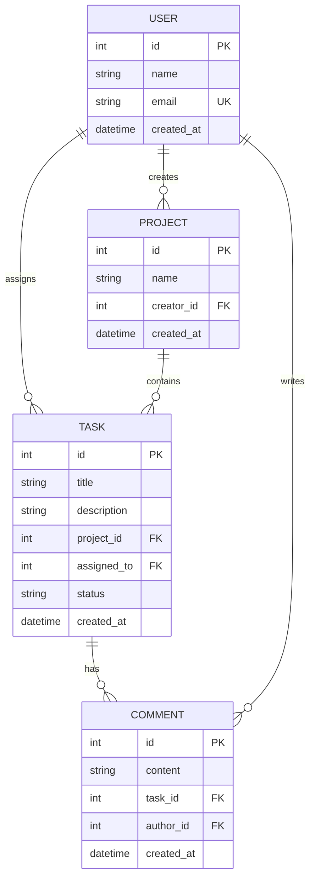
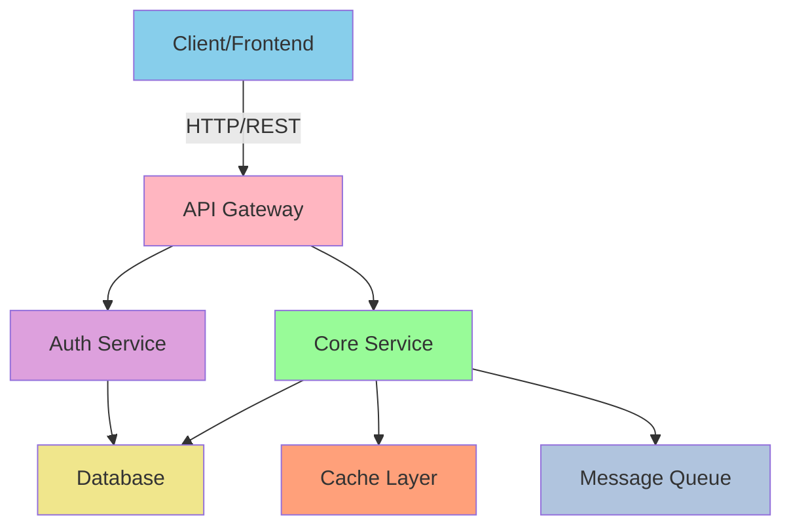
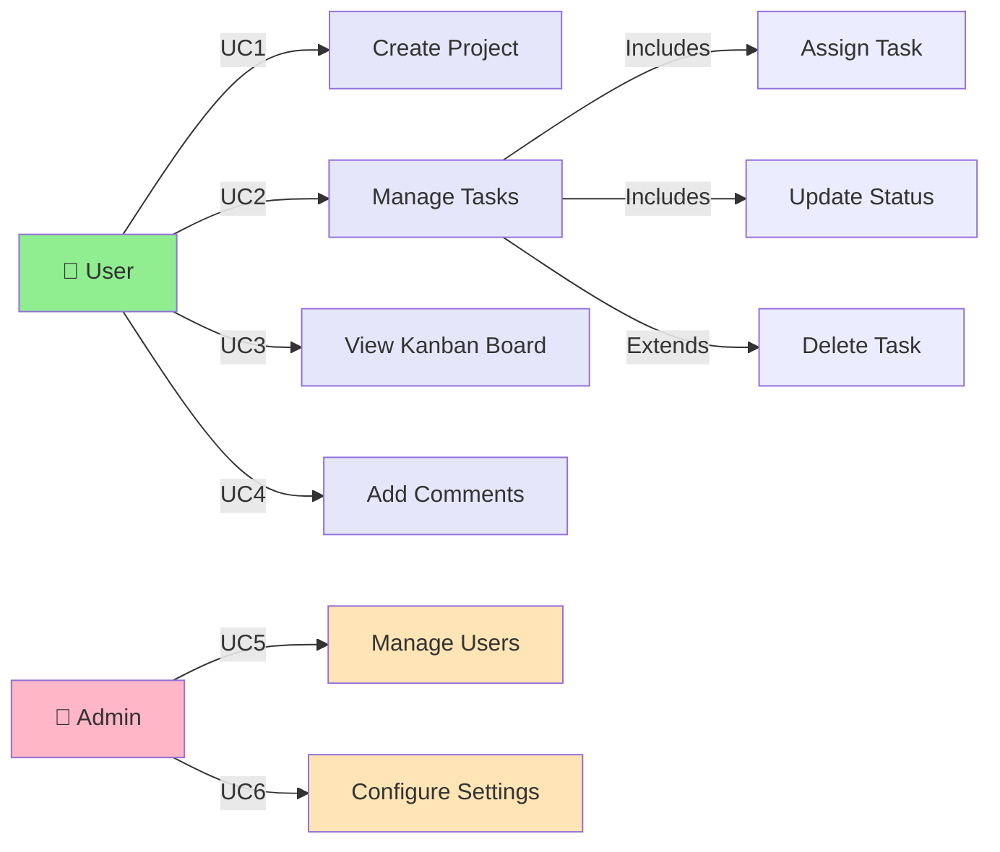
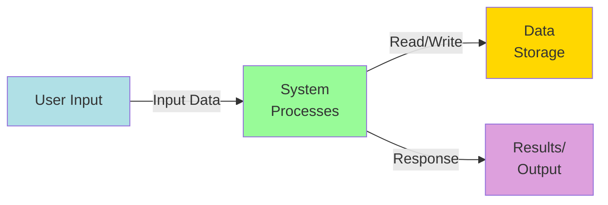
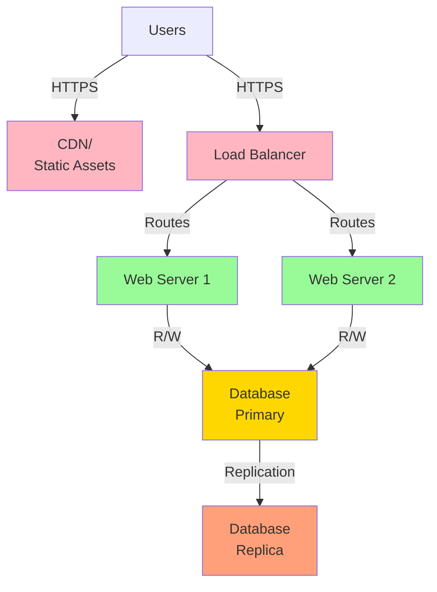

# Implementation Plan: [FEATURE]

**Branch**: `[###-feature-name]` | **Date**: [DATE] | **Spec**: [link]
**Input**: Feature specification from `/specs/[###-feature-name]/spec.md`

**Note**: This template is filled in by the `/pandawa.plan` command. See that command's own definition (the `pandawa.plan` file installed for your AI assistant) for the full execution workflow.

## Summary

[Extract from feature spec: primary requirement + technical approach from research]

## Technical Context

<!--
  ACTION REQUIRED: Replace the content in this section with the technical details
  for the project. The structure here is presented in advisory capacity to guide
  the iteration process.
-->

**Language/Version**: [e.g., Python 3.11, Swift 5.9, Rust 1.75 or NEEDS CLARIFICATION]  
**Primary Dependencies**: [e.g., FastAPI, UIKit, LLVM or NEEDS CLARIFICATION]  
**Storage**: [if applicable, e.g., PostgreSQL, CoreData, files or N/A]  
**Testing**: [e.g., pytest, XCTest, cargo test or NEEDS CLARIFICATION]  
**Target Platform**: [e.g., Linux server, iOS 15+, WASM or NEEDS CLARIFICATION]
**Project Type**: [single/web/mobile - determines source structure]  
**Architecture Type**: [e.g., monolith, standalone web app, micro-frontend + backend services, microservices or NEEDS CLARIFICATION — detect from repo/docs, do NOT assume standalone]  
**Integration Target**: [e.g., host shell app consuming this micro-frontend, API gateway, message bus or N/A]  
**Existing Design System**: [if this feature touches a UI and the repo already has other frontend code — the actual component library/framework, theme/token source, and icon set found in the repo (e.g. "Ant Design 5 + tokens in src/theme/tokens.ts, Lucide icons"), so new pages are built to match, not next to. "None found — greenfield frontend" if there's genuinely no existing FE to match. Do NOT default to a domain-profile's own reference design system when the target repo already has one of its own.]  
**Performance Goals**: [domain-specific, e.g., 1000 req/s, 10k lines/sec, 60 fps or NEEDS CLARIFICATION]  
**Constraints**: [domain-specific, e.g., <200ms p95, <100MB memory, offline-capable or NEEDS CLARIFICATION]  
**Scale/Scope**: [domain-specific, e.g., 10k users, 1M LOC, 50 screens or NEEDS CLARIFICATION]

## UI/UX & Screens (carried from spec)

<!--
  If this feature has a UI, carry the spec's "UI/UX & Screens" section forward here (screen
  inventory, per-screen states, primary interactions/flows, and the design reference). This is
  the design intent /pandawa.implement builds toward — the "Existing Design System" field above
  says WHICH components to use; this says WHAT to build with them. Remove this section only for
  features with no user interface. If the spec has no UI/UX & Screens section but the feature
  has a UI, flag it and derive a minimal screen inventory from the user stories.
-->

- **Design reference**: [Figma/mockup link or "profile design system"]
- **Screens**: [screen → purpose → key states (loading/empty/error/populated) → primary actions]
- **Primary interactions/flows**: [key navigation, deep-linking, destructive-action confirmations]

## Constitution Check

*GATE: Must pass before Phase 0 research. Re-check after Phase 1 design.*

[Gates determined based on constitution file]

## Project Structure

### Documentation (this feature)

```text
specs/[###-feature]/
├── plan.md              # This file (/pandawa.plan command output)
├── research.md          # Phase 0 output (/pandawa.plan command)
├── data-model.md        # Phase 1 output (/pandawa.plan command)
├── quickstart.md        # Phase 1 output (/pandawa.plan command)
├── contracts/           # Phase 1 output (/pandawa.plan command)
└── tasks.md             # Phase 2 output (/pandawa.tasks command - NOT created by /pandawa.plan)
```

### Source Code (repository root)
<!--
  ACTION REQUIRED: Replace the placeholder tree below with the concrete layout
  for this feature. Delete unused options and expand the chosen structure with
  real paths (e.g., apps/admin, packages/something). The delivered plan must
  not include Option labels. `scripts/bash/setup-plan.sh` and `scripts/powershell/setup-plan.ps1`
  auto-detect Laravel monolith (composer.json + artisan) and prune the generic
  Option 1/2/3 placeholder — re-run setup-plan if the repo was just scaffolded.
-->

```text
# [REMOVE IF UNUSED] Option 1: Single project (DEFAULT)
src/
├── models/
├── services/
├── cli/
└── lib/

tests/
├── contract/
├── integration/
└── unit/

# [REMOVE IF UNUSED] Option 2: Web application (when "frontend" + "backend" detected)
backend/
├── src/
│   ├── models/
│   ├── services/
│   └── api/
└── tests/

frontend/
├── src/
│   ├── components/
│   ├── pages/
│   └── services/
└── tests/

# [REMOVE IF UNUSED] Option 3: Mobile + API (when "iOS/Android" detected)
api/
└── [same as backend above]

ios/ or android/
└── [platform-specific structure: feature modules, UI flows, platform tests]
```

**Structure Decision**: [Document the selected structure and reference the real
directories captured above]

## Complexity Tracking

> **Fill ONLY if Constitution Check has violations that must be justified**

| Violation | Why Needed | Simpler Alternative Rejected Because |
| --------- | ---------- | ------------------------------------ |
| [e.g., 4th project] | [current need] | [why 3 projects insufficient] |
| [e.g., Repository pattern] | [specific problem] | [why direct DB access insufficient] |

---

## Technical Diagrams

### Data Design Decisions

<!--
  ACTION REQUIRED: Record how the source resource model (spec/PDF, via the inputs/
  digest) maps to database tables. MIRROR the source by default — one table per resource
  and per sub-resource, one column per attribute, exact enums/states/cardinality. Do NOT
  merge, flatten, or simplify. A deviation (merge/flatten/denormalize) is allowed ONLY
  when the user explicitly asks AND a lossless mapper reproduces the exact source
  contract; record it here as a deviation with the mapper note. See
  architecture/patterns/database-schema-design.md.
-->

| Source resource / sub-resource | Table(s) | Mapping | Rationale |
| ------------------------------ | -------- | ------- | --------- |
| [e.g., ActualCost] | [e.g., actual_cost] | mirror | [1:1 with source resource] |
| [e.g., actualCostItem [1..*]] | [e.g., actual_cost_item (FK actual_cost_id)] | mirror (child) | [sub-resource → child table] |
| [only if user-approved] | [e.g., cost (+ cost_type)] | deviation: merged | [user-approved; mapper reproduces ActualCost/ProjectedCost losslessly] |

### Data Model (Entity Relationship Diagram)

<!--
  ACTION REQUIRED: Create an ERD showing main entities, attributes, and relationships
  Use Mermaid erDiagram syntax. The ERD must reflect the Data Design Decisions above —
  mirroring the source resource model, deviating only where a deviation is recorded.
-->



### System Architecture

<!--
  ACTION REQUIRED: Show how different components/services interact
  Use Mermaid graph syntax for architecture overview
-->



### Use Case Diagram

<!--
  ACTION REQUIRED: Show user interactions with the system
  Map out primary and secondary use cases
-->



### Data Flow Diagram (Level 0)

<!--
  ACTION REQUIRED: Show high-level data flows between components
-->



### API Contract Overview

<!--
  ACTION REQUIRED: Summarize main API endpoints and operations
-->

| Operation | Endpoint | Method | Purpose |
| --------- | -------- | ------ | ------- |
| [Create] | `/api/[resource]` | POST | Create new [resource] |
| [Read] | `/api/[resource]/{id}` | GET | Fetch [resource] details |
| [Update] | `/api/[resource]/{id}` | PUT/PATCH | Update [resource] |
| [Delete] | `/api/[resource]/{id}` | DELETE | Remove [resource] |
| [List] | `/api/[resource]` | GET | Retrieve all [resource] |

### Deployment Architecture

<!--
  ACTION REQUIRED: Show how components are deployed
-->


