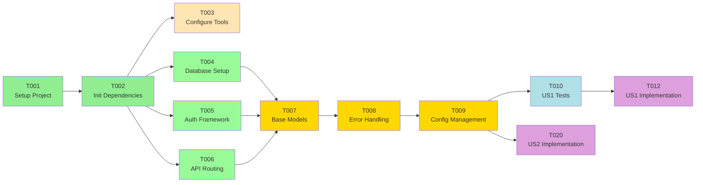
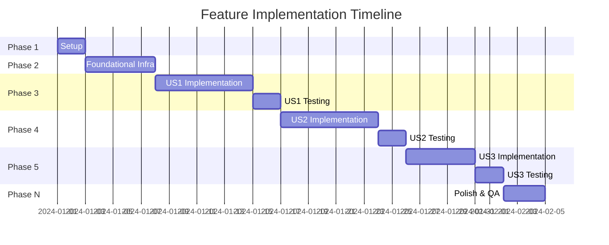
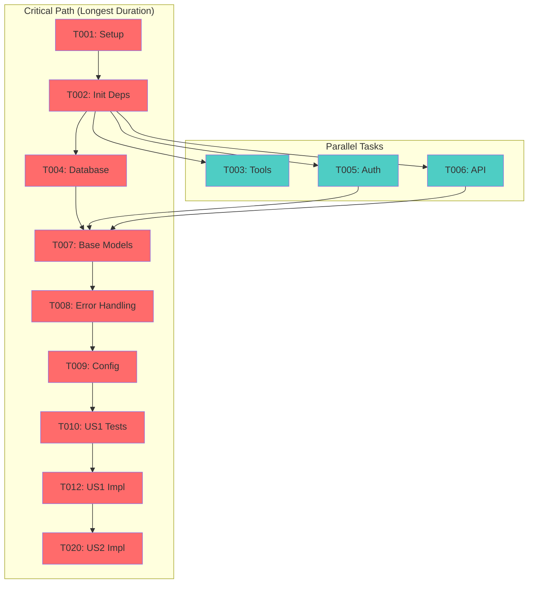
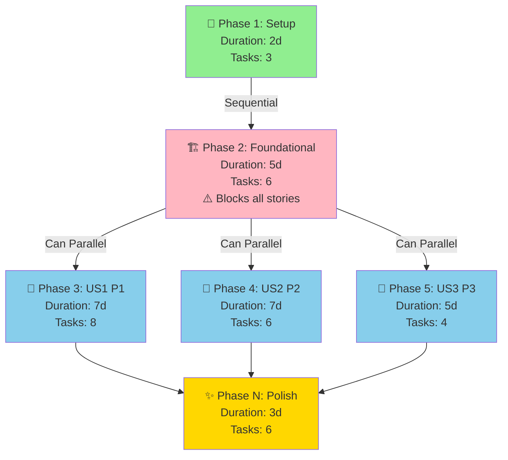

---

description: "Task list template for feature implementation"
---

# Tasks: [FEATURE NAME]

**Input**: Design documents from `/specs/[###-feature-name]/`
**Prerequisites**: plan.md (required), spec.md (required for user stories), research.md, data-model.md, contracts/

**Tests**: The examples below include test tasks. Tests are OPTIONAL - only include them if explicitly requested in the feature specification.

**Organization**: Tasks are grouped by user story to enable independent implementation and testing of each story.

**Bolts (iteration units)**: Each user-story phase below is a **Bolt** — a short, self-contained iteration (hours to a day, not a multi-week sprint) that delivers one independently testable increment and ends at a checkpoint. Size Bolts so each is deliverable in one focused session: if a single user story is too large to finish and validate in one sitting, split it into ordered Bolts (e.g. `US1 · Bolt 1: core flow`, `US1 · Bolt 2: edge cases`), each with its own checkpoint. The checkpoint at the end of every Bolt is where you stop, validate the increment independently, and commit before starting the next — this is what keeps work shippable at every step instead of accumulating a big-bang integration at the end.

## Format: `[ID] [P?] [Story] [FR-###?] Description`

- **[P]**: Can run in parallel (different files, no dependencies)
- **[Story]**: Which user story this task belongs to (e.g., US1, US2, US3)
- **[FR-###]**: Which functional requirement(s) this task satisfies, e.g. `[US1][FR-003]` (a task may cite several). Every `FR-###` in spec.md MUST appear on at least one task so `/pandawa.analyze` can verify coverage by ID. Only purely structural setup/scaffolding/config tasks that don't implement a specific FR omit it — a foundational task that implements a cross-cutting FR (auth, audit-logging) still cites it.
- Include exact file paths in descriptions

> **GitHub Issues (grouping)**: Do NOT create one issue per T00x — too noisy. Group into 3–5 issues per Bolt: Foundational, US1, US2, US3, Polish. Use `scripts/powershell/create-issues-from-tasks.ps1` (or `scripts/bash/create-issues-from-tasks.sh`) which parses `tasks.md` via `--body-file` temp files (fixes Windows `gh issue create --body "multi line"` quoting), dedupes via `gh issue list`, and throttles. Example: `create-issues-from-tasks.ps1 -GroupBy story -DryRun` then without `-DryRun`. The checklist format below (`- [ ] T001 [US1] ...`) is machine-parseable — keep `[ID] [P?]` prefix and add `[USx] [FR-xxx]` on every functional task so the script and `/pandawa.analyze` can filter by story/FR.

## Runtime Status

Keep task state in the checkbox and, when work starts, append a status marker:

```text
- [ ] T001 [pending] Create ...
- [ ] T002 [running] Implement ...
- [X] T003 [done] Add ...
- [ ] T004 [failed] Fix ...
```

Allowed markers: `pending`, `running`, `done`, `failed`. A missing marker means
`pending`. Agents MUST update the marker before and after each task so
`/pandawa.resume`, `/pandawa.parallel`, and `/pandawa.report` can recover state without
guessing from prose.

## Path Conventions

- **Single project**: `src/`, `tests/` at repository root
- **Web app**: `backend/src/`, `frontend/src/`
- **Mobile**: `api/src/`, `ios/src/` or `android/src/`
- Paths shown below assume single project - adjust based on plan.md structure

<!-- 
  ============================================================================
  IMPORTANT: The tasks below are SAMPLE TASKS for illustration purposes only.
  
  The /pandawa.tasks command MUST replace these with actual tasks based on:
  - User stories from spec.md (with their priorities P1, P2, P3...)
  - Feature requirements from plan.md
  - Entities from data-model.md
  - Endpoints from contracts/
  
  Tasks MUST be organized by user story so each story can be:
  - Implemented independently
  - Tested independently
  - Delivered as an MVP increment
  
  DO NOT keep these sample tasks in the generated tasks.md file.
  ============================================================================
-->

## Phase 1: Setup (Shared Infrastructure)

**Purpose**: Project initialization and basic structure

- [ ] T001 Create project structure per implementation plan
- [ ] T002 Initialize [language] project with [framework] dependencies
- [ ] T003 [P] Configure linting and formatting tools

---

## Phase 2: Foundational (Blocking Prerequisites)

**Purpose**: Core infrastructure that MUST be complete before ANY user story can be implemented

**⚠️ CRITICAL**: No user story work can begin until this phase is complete

Examples of foundational tasks (adjust based on your project):

- [ ] T004 Setup database schema and migrations framework
- [ ] T005 [P] Implement authentication/authorization framework
- [ ] T006 [P] Setup API routing and middleware structure
- [ ] T007 Create base models/entities that all stories depend on
- [ ] T008 Configure error handling and logging infrastructure
- [ ] T009 Setup environment configuration management

**Checkpoint**: Foundation ready - user story implementation can now begin in parallel

---

## Phase 3: User Story 1 - [Title] (Priority: P1) 🎯 MVP

**Goal**: [Brief description of what this story delivers]

**Independent Test**: [How to verify this story works on its own]

### Tests for User Story 1 (OPTIONAL - only if tests requested) ⚠️

> **NOTE: Write these tests FIRST, ensure they FAIL before implementation**

- [ ] T010 [P] [US1] [FR-001] Contract test for [endpoint] in tests/contract/test_[name].py
- [ ] T011 [P] [US1] Integration test for [user journey] in tests/integration/test_[name].py

### Implementation for User Story 1

- [ ] T012 [P] [US1] Create [Entity1] model in src/models/[entity1].py
- [ ] T013 [P] [US1] Create [Entity2] model in src/models/[entity2].py
- [ ] T014 [US1] Implement [Service] in src/services/[service].py (depends on T012, T013)
- [ ] T015 [US1] Implement [endpoint/feature] in src/[location]/[file].py
- [ ] T016 [US1] Add validation and error handling
- [ ] T017 [US1] Add logging for user story 1 operations

**Checkpoint**: At this point, User Story 1 should be fully functional and testable independently

---

## Phase 4: User Story 2 - [Title] (Priority: P2)

**Goal**: [Brief description of what this story delivers]

**Independent Test**: [How to verify this story works on its own]

### Tests for User Story 2 (OPTIONAL - only if tests requested) ⚠️

- [ ] T018 [P] [US2] Contract test for [endpoint] in tests/contract/test_[name].py
- [ ] T019 [P] [US2] Integration test for [user journey] in tests/integration/test_[name].py

### Implementation for User Story 2

- [ ] T020 [P] [US2] Create [Entity] model in src/models/[entity].py
- [ ] T021 [US2] Implement [Service] in src/services/[service].py
- [ ] T022 [US2] Implement [endpoint/feature] in src/[location]/[file].py
- [ ] T023 [US2] Integrate with User Story 1 components (if needed)

**Checkpoint**: At this point, User Stories 1 AND 2 should both work independently

---

## Phase 5: User Story 3 - [Title] (Priority: P3)

**Goal**: [Brief description of what this story delivers]

**Independent Test**: [How to verify this story works on its own]

### Tests for User Story 3 (OPTIONAL - only if tests requested) ⚠️

- [ ] T024 [P] [US3] Contract test for [endpoint] in tests/contract/test_[name].py
- [ ] T025 [P] [US3] Integration test for [user journey] in tests/integration/test_[name].py

### Implementation for User Story 3

- [ ] T026 [P] [US3] Create [Entity] model in src/models/[entity].py
- [ ] T027 [US3] Implement [Service] in src/services/[service].py
- [ ] T028 [US3] Implement [endpoint/feature] in src/[location]/[file].py

**Checkpoint**: All user stories should now be independently functional

---

[Add more user story phases as needed, following the same pattern]

---

## Phase N: Polish & Cross-Cutting Concerns

**Purpose**: Improvements that affect multiple user stories

- [ ] TXXX [P] Documentation updates in docs/
- [ ] TXXX Code cleanup and refactoring
- [ ] TXXX Performance optimization across all stories
- [ ] TXXX [P] Additional unit tests (if requested) in tests/unit/
- [ ] TXXX Security hardening
- [ ] TXXX Run quickstart.md validation

---

## Dependencies & Execution Order

### Phase Dependencies

- **Setup (Phase 1)**: No dependencies - can start immediately
- **Foundational (Phase 2)**: Depends on Setup completion - BLOCKS all user stories
- **User Stories (Phase 3+)**: All depend on Foundational phase completion
  - User stories can then proceed in parallel (if staffed)
  - Or sequentially in priority order (P1 → P2 → P3)
- **Polish (Final Phase)**: Depends on all desired user stories being complete

### User Story Dependencies

- **User Story 1 (P1)**: Can start after Foundational (Phase 2) - No dependencies on other stories
- **User Story 2 (P2)**: Can start after Foundational (Phase 2) - May integrate with US1 but should be independently testable
- **User Story 3 (P3)**: Can start after Foundational (Phase 2) - May integrate with US1/US2 but should be independently testable

### Within Each User Story

- Tests (if included) MUST be written and FAIL before implementation
- Models before services
- Services before endpoints
- Core implementation before integration
- Story complete before moving to next priority

### Parallel Opportunities

- All Setup tasks marked [P] can run in parallel
- All Foundational tasks marked [P] can run in parallel (within Phase 2)
- Once Foundational phase completes, all user stories can start in parallel (if team capacity allows)
- All tests for a user story marked [P] can run in parallel
- Models within a story marked [P] can run in parallel
- Different user stories can be worked on in parallel by different team members

---

## Parallel Example: User Story 1

```bash
# Launch all tests for User Story 1 together (if tests requested):
Task: "Contract test for [endpoint] in tests/contract/test_[name].py"
Task: "Integration test for [user journey] in tests/integration/test_[name].py"

# Launch all models for User Story 1 together:
Task: "Create [Entity1] model in src/models/[entity1].py"
Task: "Create [Entity2] model in src/models/[entity2].py"
```

---

## Implementation Strategy

### MVP First (User Story 1 Only)

1. Complete Phase 1: Setup
2. Complete Phase 2: Foundational (CRITICAL - blocks all stories)
3. Complete Phase 3: User Story 1
4. **STOP and VALIDATE**: Test User Story 1 independently
5. Deploy/demo if ready

### Incremental Delivery (one Bolt at a time)

1. Complete Setup + Foundational → Foundation ready
2. Add User Story 1 (Bolt) → Test independently → checkpoint/commit → Deploy/Demo (MVP!)
3. Add User Story 2 (Bolt) → Test independently → checkpoint/commit → Deploy/Demo
4. Add User Story 3 (Bolt) → Test independently → checkpoint/commit → Deploy/Demo
5. Each Bolt adds value without breaking previous ones — the increment is shippable at every checkpoint

### Parallel Team Strategy

With multiple developers:

1. Team completes Setup + Foundational together
2. Once Foundational is done:
   - Developer A: User Story 1
   - Developer B: User Story 2
   - Developer C: User Story 3
3. Stories complete and integrate independently

---

## Task Dependencies & Timeline

### Dependency Graph

<!--
  ACTION REQUIRED: Visualize task dependencies to understand critical path
-->



### Gantt Timeline

<!--
  ACTION REQUIRED: Show estimated timeline for phases/user stories
  Adjust timeline based on your project complexity
-->



### Critical Path Analysis

<!--
  ACTION REQUIRED: Identify and highlight critical path (longest dependency chain)
-->



### Phase Structure Diagram

<!--
  Visual representation of how phases build on each other
-->



### Resource Allocation

<!--
  ACTION REQUIRED: Show how tasks can be distributed among team members
-->

| Phase | Task Count | Parallel Capacity | Recommended Team |
| ----- | --------- | ---------------- | --------------- |
| Setup | 3 | 2 | 1 person |
| Foundational | 6 | 3-4 | 2-3 people |
| US1 (P1) | 8 | 4 | 2 people |
| US2 (P2) | 6 | 3 | 1 person |
| US3 (P3) | 4 | 2 | 1 person |
| Polish | 6 | 3 | 1-2 people |

---

## Notes

- [P] tasks = different files, no dependencies
- [Story] label maps task to specific user story for traceability
- Each user story should be independently completable and testable
- Verify tests fail before implementing
- Commit after each task or logical group
- Each user-story phase is a **Bolt** (a short, one-session iteration); its checkpoint is where you stop, validate the increment independently, and commit before the next Bolt
- Stop at any checkpoint to validate story independently
- Avoid: vague tasks, same file conflicts, cross-story dependencies that break independence
- **Critical Path**: The longest chain of dependent tasks determines minimum project duration
- **Parallel Opportunities**: Tasks not on critical path can run in parallel to compress timeline
